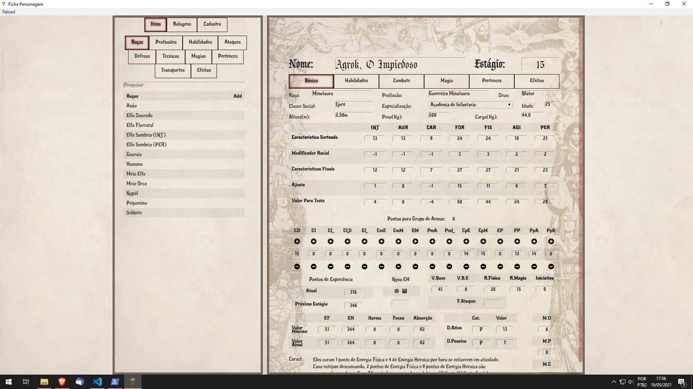

# Fichas Automatizadas Tagmar RPG
Aplicação simples feita em python que roda um servidor em Flask, possui banco de dados em sqlite para salvar fichas tanto de Personagens quanto de NPCs.
## Ultimas Releases com interface gráfica em electron.js
### [Releases](https://github.com/marcoswalker/FichasTagmar/releases) 

## Instruções para rodar em python (acessando apenas pelo navegador)
1. Instalar Python na versão 3, utilizei a versão 3.9.2 no windows 10 e versão 3.8.8 no windows 7.
2. Instalar o flask no console (python -m pip install flask)
3. Instalar flask_sqlalchemy (python -m pip install flask_sqlalchemy)
4. Rodar o programa (python app.py)
5. Abrir seu navegador no endereço http://127.0.0.1:5000 ou http://localhost:5000